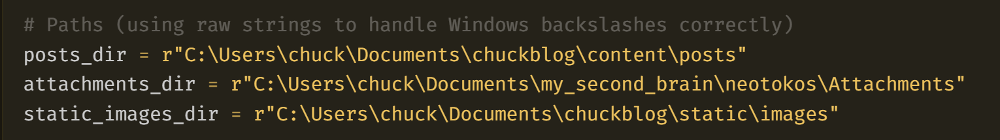
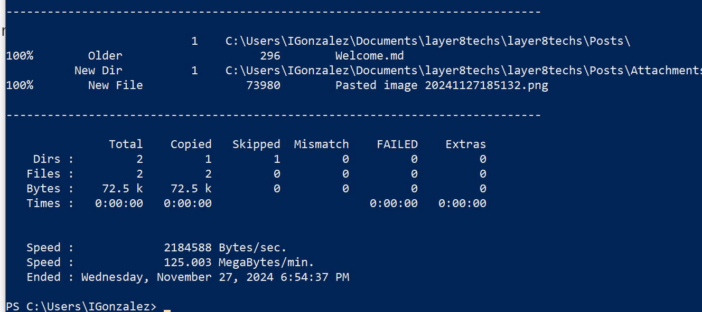

This is your new *vault*.*






```markup
robocopy sourcepath destination path /mir
```
Make a note of something, [[create a link]], or try [the Importer](https://help.obsidian.md/Plugins/Importer)!

When you're ready, delete this note and make the vault your own.